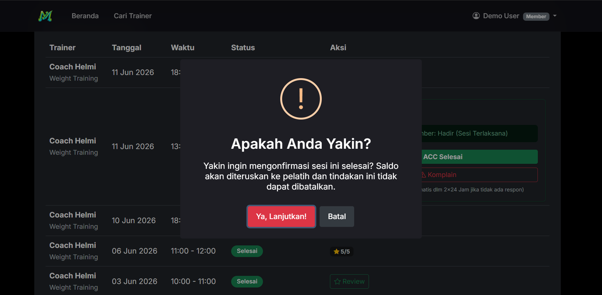
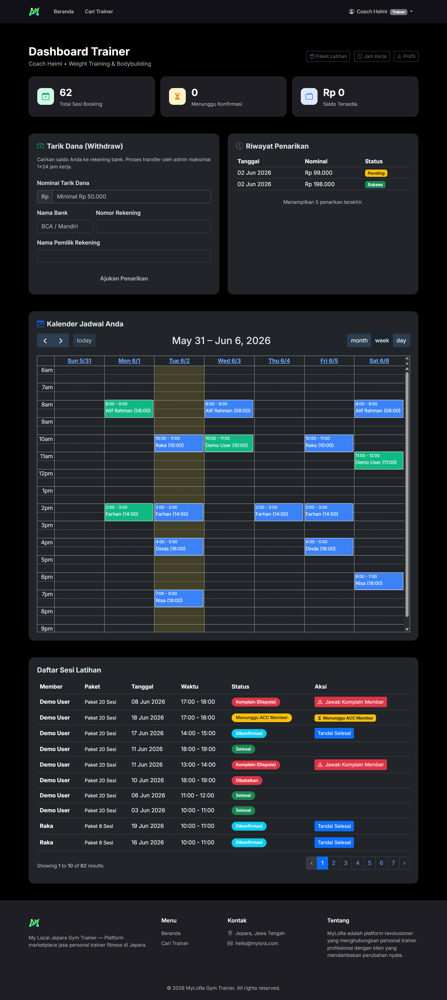
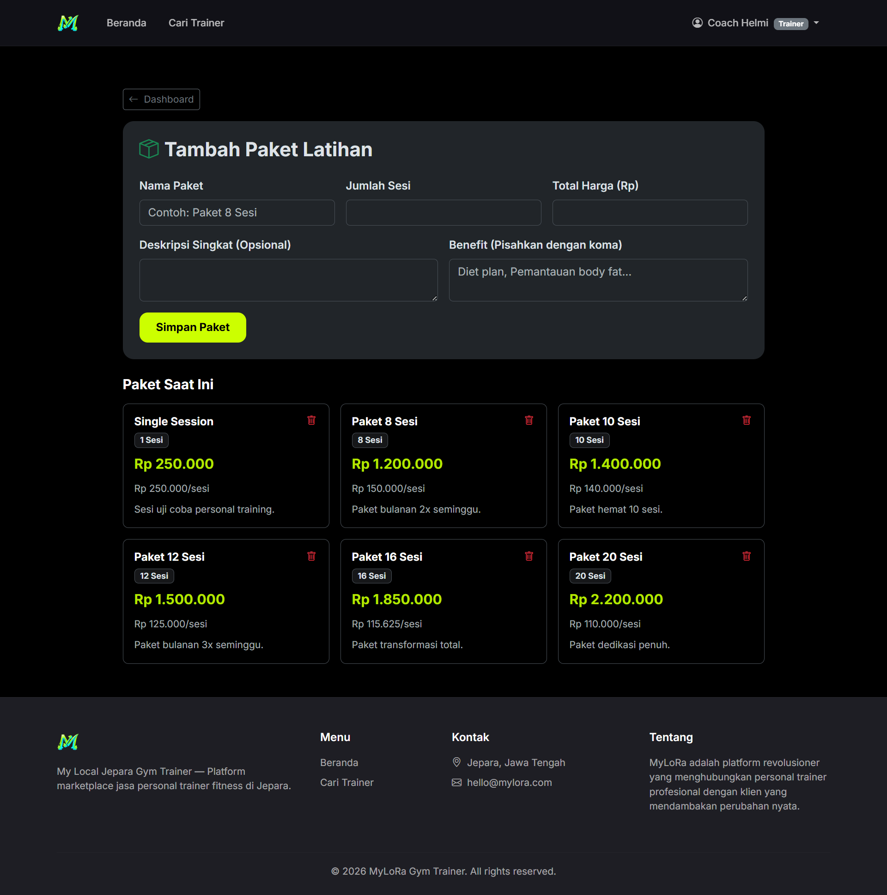
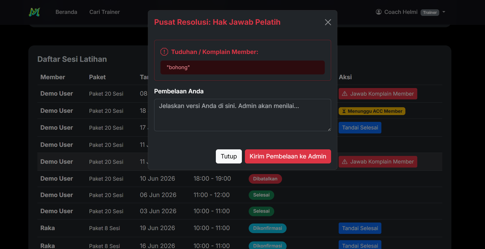
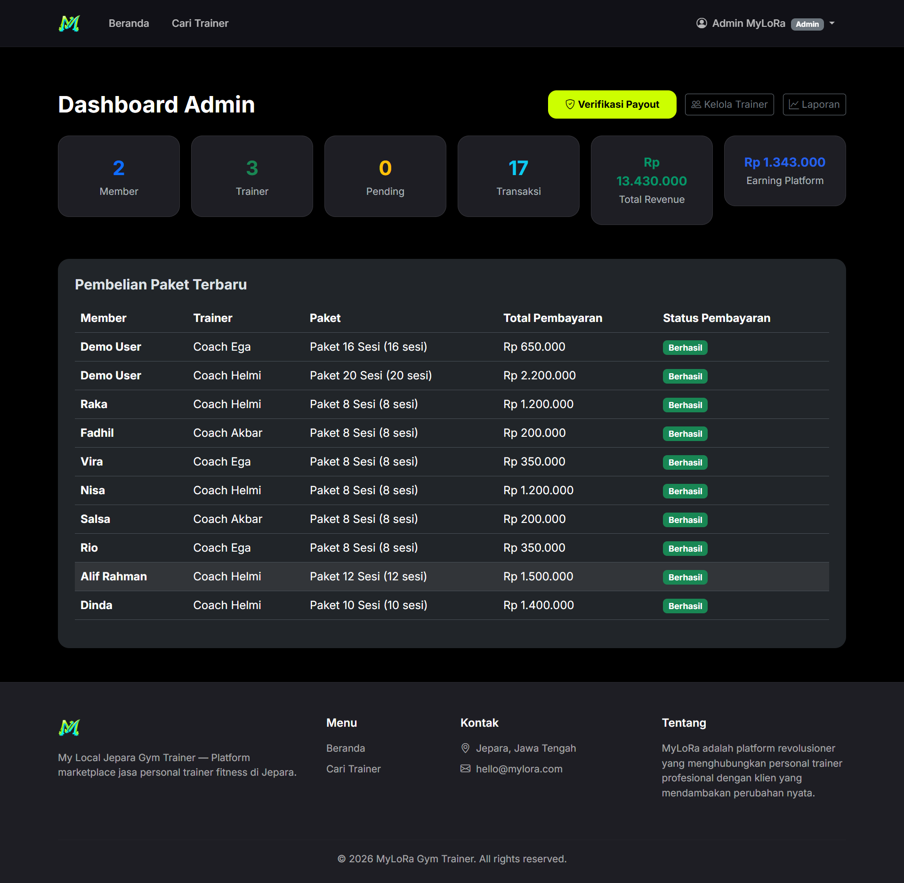
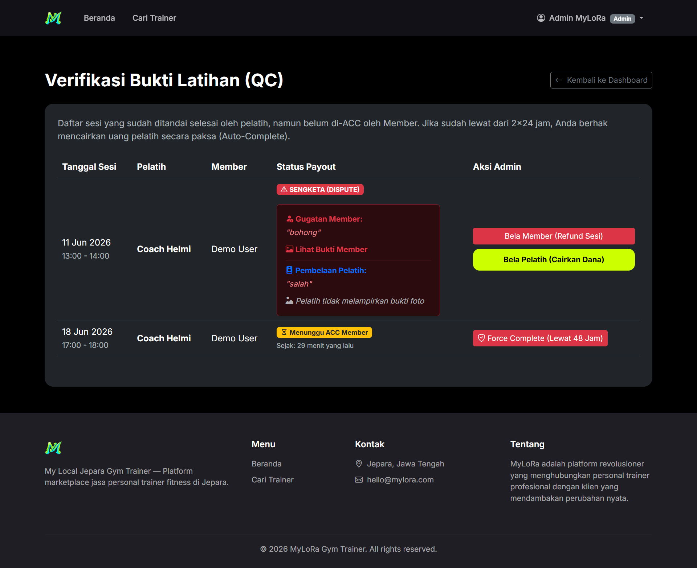

# 🏋️ MyLoRa Gym Trainer

**My Local Jepara Gym Trainer** — Platform marketplace jasa personal trainer fitness di Jepara.

MyLoRa menghubungkan personal trainer profesional dengan member yang ingin mencapai tujuan fitness mereka. Dilengkapi dengan sistem booking, pembayaran online (Midtrans), escrow, dan resolusi sengketa.

## 📖 Latar Belakang & Pendekatan Riset

Aplikasi ini dikembangkan berdasarkan pendekatan riset akademik (studi kasus di Jepara) untuk mengidentifikasi dan memecahkan masalah nyata dalam ekosistem kebugaran lokal. Dari hasil observasi awal, ditemukan tiga masalah utama (*Pain Points*):
1. **Asimetri Informasi & Visibilitas:** Masyarakat awam kesulitan mencari pelatih kebugaran yang kredibel dan bersertifikasi di daerah mereka.
2. **Konflik Penjadwalan (Scheduling Collision):** Proses *booking* manual via WhatsApp seringkali menyebabkan bentrok jadwal antara pelatih dan klien yang berbeda.
3. **Krisis Kepercayaan (Trust Issue):** Tidak adanya jaminan keamanan dana jika pelatih membatalkan sesi atau klien tidak hadir (*no-show*).

Sebagai solusi konseptual, **MyLoRa (My Local Jepara)** dirancang sebagai *platform marketplace* dengan pendekatan *Heuristic Recommender System*, *Interval Scheduling*, dan *Escrow Wallet System* guna menciptakan ekosistem kebugaran yang transparan, aman, dan terotomatisasi.

## 📱 App Preview

<details>
<summary><b>Klik untuk melihat tampilan aplikasi</b></summary>
<br>

**1. Halaman Beranda (Home)**


**2. Halaman Login**


**3. Halaman Register**


**4. Onboarding Member Baru**


**5. Rekomendasi Pelatih (Hasil Onboarding)**


**6. Halaman Cari Trainer (Katalog)**


**7. Halaman Profil & Paket Pelatih**


**8. Memilih Paket & Booking Sesi (Member)**


**9. Checkout Paket Latihan (Member)**


**10. Pembayaran Online Midtrans (Member)**


**11. Dashboard Member**


**12. Penjadwalan Sesi Latihan (Kalender)**


**13. Dashboard Pelatih (Trainer)**


**14. Pengaturan Profil Pelatih**


**15. Manajemen Paket Latihan (Pelatih)**


**16. Pengaturan Ketersediaan Waktu (Pelatih)**


**17. Konfirmasi Booking (Pelatih)**


**18. Laporan Sesi Selesai & Upload Bukti (Pelatih)**


**19. Dompet (Wallet) & Penarikan Dana (Pelatih)**


**20. Dashboard Admin Utama**


**21. Manajemen Pelatih (Admin)**


**22. Pusat Resolusi Sengketa & QC Payout (Admin)**


**23. Laporan Pendapatan Platform (Admin)**


</details>

## 🧠 Algoritma & Konsep Sistem Utama

Untuk menjawab pertanyaan teknis terkait arsitektur perangkat lunak, MyLoRa mengimplementasikan beberapa algoritma dan logika sistem berikut:

1. **Heuristic Scoring Algorithm (Sistem Rekomendasi)**
   Digunakan pada fitur *Onboarding* Member. Sistem akan mengumpulkan preferensi *user* (tujuan latihan, level pengalaman, preferensi gender pelatih) lalu melakukan iterasi komputasi bobot (*weighting*) terhadap seluruh data pelatih yang aktif. Pelatih dengan skor kecocokan (*matching score*) tertinggi akan diurutkan dan direkomendasikan secara dinamis.
   
2. **Interval Scheduling & Collision Detection (Sistem Penjadwalan)**
   Sistem penjadwalan MyLoRa menggunakan logika *Time-Slot Generation* dengan pendekatan pemfilteran himpunan (*Set Difference*). Saat Member memilih tanggal, sistem membangun daftar slot waktu berdasarkan ketersediaan (*availability*) mingguan pelatih, lalu melakukan deteksi bentrok (*collision detection*) dengan query database (`WHERE BETWEEN`) untuk menghapus slot yang sudah di-*booking* oleh member lain.

3. **Deterministic Finite Automaton / DFA (Siklus Transaksi)**
   Seluruh *booking* dikelola menggunakan konsep *State Machine* (Mesin Status) yang ketat. Transaksi memiliki alur transisi mutlak: `pending` → `confirmed` → `waiting_confirmation` (atau `disputed`) → `completed`. Status tidak bisa melompati tahapan tanpa validasi otorisasi ganda (dari member maupun pelatih).

4. **Escrow System Logic (Pusat Resolusi Dana)**
   Sistem keamanan dana menggunakan logika Rekening Bersama (*Escrow*). Saat member membayar, dana ditahan di *Platform Wallet* (Midtrans). Dana baru akan dialokasikan (`increment()`) ke tabel `wallet_balance` pelatih hanya jika terjadi salah satu dari *Trigger Event* berikut: (a) Member menekan "ACC Selesai", (b) Sistem *Auto-Complete* lewat dari 48 jam, atau (c) Admin memenangkan pelatih dalam forum Sengketa (*Dispute*).

## ✨ Fitur Utama

### 👤 Member (Customer)
- Pencarian & filter personal trainer berdasarkan kategori
- Pembelian paket latihan dengan pembayaran online (Midtrans Snap)
- Booking sesi latihan individu berdasarkan jadwal trainer
- Validasi bentrok jadwal real-time
- Pembatalan jadwal mandiri (H-2)
- Konfirmasi sesi selesai & sistem review/rating
- Dispute/komplain dengan sistem escrow

### 🏅 Trainer (Pelatih)
- Pendaftaran profil & verifikasi admin
- Manajemen paket latihan, jadwal ketersediaan
- Kalender mingguan interaktif
- Konfirmasi booking & laporan sesi + upload bukti foto
- Wallet & penarikan dana (withdraw)
- Hak jawab atas komplain member

### 🔧 Admin
- Dashboard statistik (pendapatan, transaksi, pengguna)
- Verifikasi & approval trainer
- Laporan keuangan (platform fee 10%)
- Pusat resolusi sengketa (dispute)
- Verifikasi bukti latihan (QC/Payout)
- Manajemen penarikan dana trainer

## 🛠️ Tech Stack

- **Backend:** Laravel 12 (PHP 8.2+)
- **Database:** SQLite (development) / MySQL (production)
- **Frontend:** Blade + Bootstrap 5 + Bootstrap Icons
- **Payment Gateway:** Midtrans Snap
- **Authentication:** Laravel Breeze
- **Confirmation Dialogs:** SweetAlert2

## 🚀 Instalasi & Persiapan Data

```bash
# Clone repository
git clone https://github.com/asbimantara/mylora-gym-trainer.git
cd mylora-gym-trainer

# Install dependencies
composer install
npm install && npm run build

# Setup Environment
cp .env.example .env
php artisan key:generate

# Setup Database & Dummy Data
php artisan migrate --seed
```

### 🔑 Data Akun & Simulasi (Penting untuk Demo)
Saya telah melampirkan *file* data *dummy* lengkap yang siap Anda gunakan saat presentasi/uji coba:
1. **[Daftar Akun Login (Admin, Member, Pelatih)](docs/akun_login.md)** 
2. **[Data Skenario Jadwal Booking Pelatih](docs/jadwal_booking_coach.md)**
# Create storage symlink
php artisan storage:link

# Run development server
php artisan serve
```

## 👥 Akun Demo

| Role    | Email              | Password |
|---------|--------------------|----------|
| Admin   | admin@mylora.com   | password |
| Member  | demo@mylora.com    | password |
| Trainer | trainer1@mylora.com| password |
| Trainer | trainer2@mylora.com| password |
| Trainer | trainer3@mylora.com| password |

## 💰 Model Bisnis

Platform mengambil **biaya layanan 10%** yang dibebankan kepada member saat checkout. Trainer menerima **100% dari harga paket** yang mereka tetapkan, tanpa potongan saat penarikan dana.

## 📄 Lisensi

Proyek ini dibuat untuk keperluan akademik/tugas akhir.

---

**© 2026 MyLoRa Gym Trainer** — All rights reserved.
